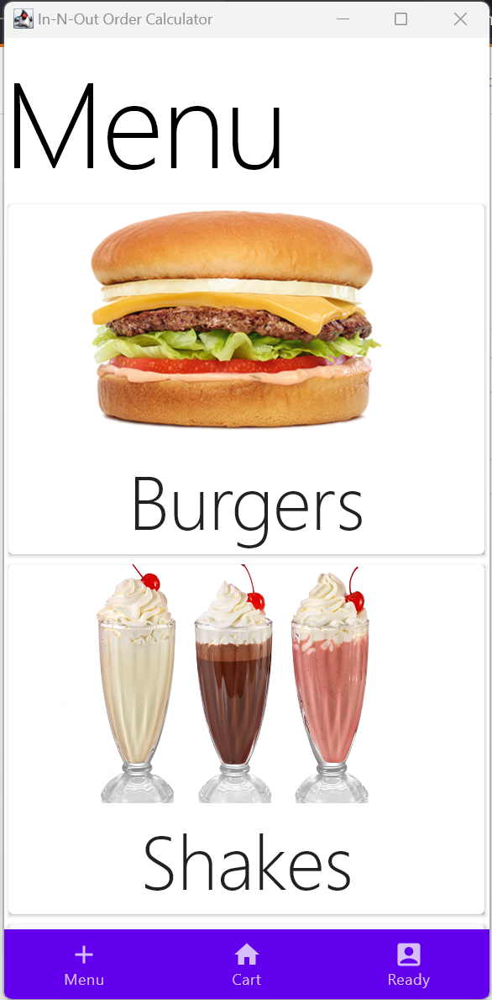
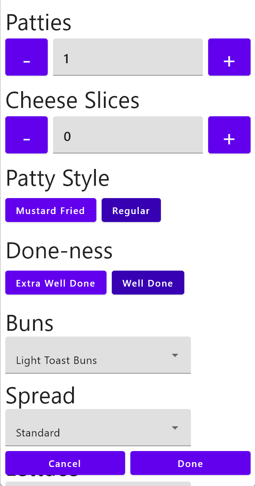

# In-N-Out-Order-Builder
 A simple app to build your In-N-Out order without knowing the code words. Mostly this is for me to learn a little bit about Compose Multiplatform (how good it is, how nice it is to Android/iOS/Desktop/etc) and play with some other libraries. Built using Voyager (for Navigation and other little things), Compose Multiplatform, Koin (for DI).





# Notes
 If you are building on a non-OSX host, you will see a warning when you build:
 ```
 The following Kotlin/Native targets cannot be built on this machine and are disabled:
iosArm64, iosSimulatorArm64, iosX64
```
It's fine, don't worry about it.

# Known Deficiencies
- There aren't really any nice animations. I love animations! But I wanted the app working first
- Strings are hardcoded, and not retrieved from resource files. I haven't looked into how to do this in compose multiplatform.
- I haven't actually tested this on iOS yet (I don't have an iOS device), but it should work with pretty minimal modifications.
- There is a little bit of jank when it comes to passing in navigation actions into the viewmodels. In my opinion it's OK for an app of this scope, but, you know, do as I say and all that!
- The item configuration screen requires double-tapping selecitons to work (I have seen stuff like this before, it's probably something silly). 
- The item name generation isn't working right, and needs unit tests. Specifically, the logic to say "No spread" or other default toppings is being applied to all toppings, which is wrong and overly verbose.
- The app doesn't have an appopriate theme (just KMP defaults). I presume the Jetpack Compose Theme Designer could be made to work with this, but I haven't investigated yet.

## A note for fellow engineers
I created this project to get my hands dirty with Compose Multiplatform. Although I apply basic design patterns (MVVM, etc), this code was written for no payment in my spare time.

Please understand this is not something I would be comfortable releasing to the public as a complete application.
